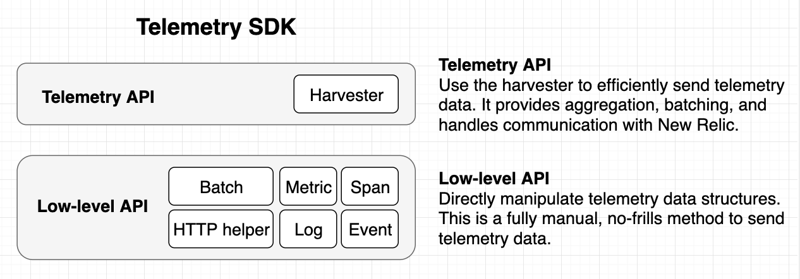

# Telemetry SDK APIs

The Telemetry SDK has two levels of API.

## Telemetry API

 The top-level telemetry API offers a harvester that can aggregate, batch, and send the data to New Relic on a regular interval. It handles communication with New Relic and will automatically retry requests, split overly large payloads, and backoff in the face of rate limiting. This level showcases the best practices for sending data to New Relic and is what almost everyone should use.

### Harvester
* harvester is shared across telemetry types
* methods to record metrics and spans
* decouple aggregation and batching
* error handling - this level is more likely to be used from application code, make it impossible for the user to handle errors

#### Batching
* The harvester batches telemetry using the configured interval

#### Aggregation
* The harvester handles aggregation for metrics
* Metrics are aggregated differently by type, see below

## Low-level API

While the telemetry API tries to be helpful, it is supported by a low-level “no frills” API that won’t do anything unless asked explicitly. It knows about the New Relic data structures, like spans and summary metrics. It can accept a batch of telemetry data and return an HTTP request object or send it for you and return the response object. If you really need to directly manipulate and send data without built-in aggregation, this API offers that full control.

### Batches
* A batch has methods to accept telemetry
* It can return a request object or make the call itself and return the response
* No error handling (say why)

### Metrics
* To what extent is this just documenting the metrics backend?
* Do we want to talk about attributes here? Limits/cardinality/how common attributes work?

##### Metric Identities
* Metrics are uniquely defined and aggregated by their `name`, `type` and `attribute keys + values`

#### Gauge

#### Delta count

#### Cumulative count
* Special logic here

#### Summary

### Spans
* To what extent is this just documenting the traces backend?

[Intrinsic attributes](https://source.datanerd.us/ingest/ingest-specs/blob/master/nrCommonFormat.md#intrinsic-attributes) are required for the telemetry to be accepted by our backend service and are separated from the custom attributes provided by the customer. The SDK is responsible for ensuring all intrinsics are present and that the telemetry format is valid.
