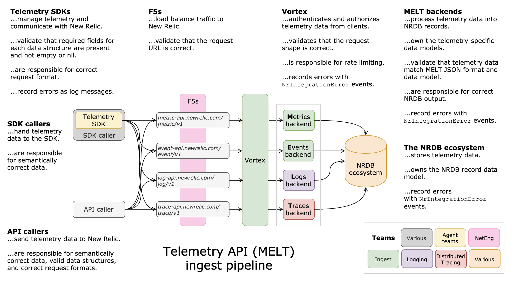

# Validation

The New Relic telemetry ingest pipeline performs lightweight synchronous validation on all inbound requests as well as a more thorough asynchronous validation on the payload contents. SDK implementations **SHOULD** only perform minimal validation on input data as noted below.

## MELT ingest pipeline

## SDK validation

In an effort to keep SDK complexity low the SDK implementation **MUST** limit its validation to the bare minimum required to be safe for clients. The SDK **MUST NOT** throw exceptions or errors on data ingest unless the caller is explicitly notified of the possibility. 

Data **MUST** always be accepted and sent to the telemetry ingest APIs unless storing, marshalling or sending it would result in an immediate exception. In cases where the data is invalid it **MUST** be dropped.

For example, in languages where `NaN` or `Infinity` can be represented these values may be stored but can not be correctly marshalled to JSON and thus are dropped when JSON marshalling occurs because it violates the safety of the payload.

## New Relic backend validation

The New Relic telemetry ingest pipline has its own set of limits and restrictions on inbound data that it enforces at various stages of data ingest.

Initial lightweight validation of inbound requests occur synchronously and result in [Response codes](#response-codes) being sent back to the SDK to indicate failed validation.

A more thorough validation of payload contents occurs asynchronously the SDK will not be directly notified of this failure. Instead, a custom event named `NrIntegrationError` is emitted to the account that includes data about the failure. Some potential failure cases are listed below:

| Failure | Discard data point | Discard payload |
| ------- | -------------------| ----------------|
| Invalid JSON | n/a | yes |
| Invalid `common` section | n/a | yes |
| Invalid or missing intrinsics (e.g. - `metricType`, `timestamp`) | yes | no |
| Payload timestamp is not within the last 48 hours (in either direction) | yes | n/a |

### New Relic storage constraints

The New Relic backend has limits on the size and number of attributes that may be stored for data points. Detailed explanations of these limits can be found here: [Metric API Limits](https://docs.google.com/document/d/1YQniWHGxO6WcOk3AQLOzchiMksNJ3zCY_aPo8Zk8des/edit#heading=h.bp5nzjycedpw)
